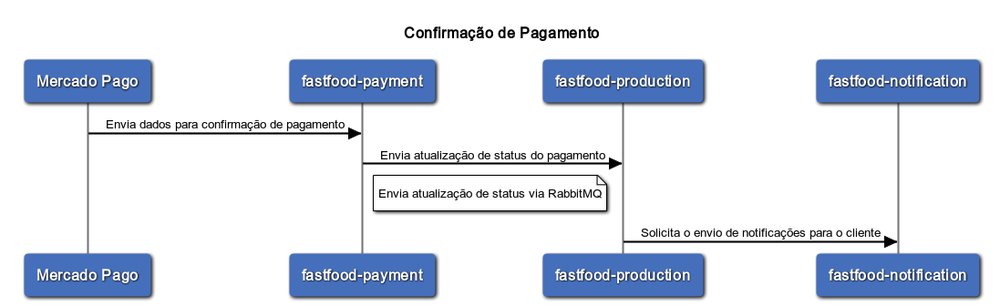

# fastfood-payment

Serviço responsável pelo gerenciamento de pagamentos do sistema fastfood


- Geração de QR Code através de integração com Mercado Pago
- Consulta de status de pagamento
- Webhook para confirmação de pagamento


<br>


### [Api Pagamento](#Api_Pagamento)

***

#### **Gerar QR Code**

Exemplo Payload :
```javascript
POST /pagamento
{
  "numeroPedido": "e5e09e8d-a2c9-4ff3-82d6-2c36db28c982",
  "produtos": [
    {
      "id": 1,
      "nome": "Cheese Burger",
      "descricao": "Cheese Burger",
      "preco": 15.5,
      "quantidade": 1
    }
  ],
  "dataCriacaoPedido": "2024-01-23T01:03:30.492Z",
  "valorTotal": 15.5
}
```


<br>
<br>
#### **Consulta de status de pagamento**
- Consulta pedido para obter status do pagamento
 
```javascript
GET pagamento/e5e09e8d-a2c9-4ff3-82d6-2c36db28c982/statusPagamento
```
<br>


<br>

#### **Webhook para confirmação de pagamento**
- Confirmação de pagamento
  Request:
```javascript
POST pagamento/confirmacaoPagamento
{
  "id": "4896ca0c-016d-4dc4-a05f-98d1ea912fd7",
  "action": "confirmar",
  "date_created": "2024-01-23T02:27:49.964Z",
  "data": {
    "id": "2b188bf7-9b9e-4fe5-9478-0e44c06c32a9"
  }
}
```
<br>



<br>

### [Tecnologias](#Tecnologias)
***
* Java
* Spring Boot
* Swagger
* Docker
* Kubernetes

<br>

### [Grupo 7](#grupo-7)
***
* Jackson Carlos Leite Ramalho
* Valqueline Nicácio da Silva
